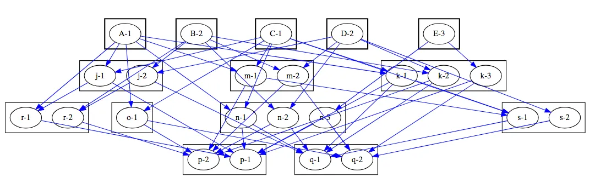

= Monorepo
:source-highlighter: rouge
:toc: macro

How to build a monorepo with `Git`, `Maven` and `Jenkins`.
Which problems it solves and which problems it brings.

toc::[]

== What is Monorepo
One project, one repository, one CI job is the most popular setup.
However, not always most convenient.

When one repository keeps few projects, we call it mono repository => monorepo.
In monorepo we can apply changes to multiple projects - modules -  via one commit.

Big-known companies use monorepo. I.e:

* Google keeps everything in `Piper` and builds with `Bazel`, see https://qeunit.com/blog/how-google-does-monorepo/[how-google-does-monorepo]
* Facebook keeps everything in `Mercurial` and builds with `Buck`, see https://softwareengineering.stackexchange.com/questions/452535/why-does-meta-facebook-use-mono-repo-in-their-source-control[why-does-meta-facebook-use-mono-repo-in-their-source-control]
* Uber, see https://www.uber.com/en-NL/blog/go-monorepo-bazel/[go-monorepo-bazel]

You don't have to be a Google to have a monorepo.

In this post, I'll show how to build a monorepo with `Git`, `Maven` and `Jenkins`,
wWhich problems a monorepos solves and which problems it brings.

== Problem
First, let me show which problems a classic "one project, one repository" setup brings.
In most cases, it works the inconveniences start when you need to make changes in few repos.

Situation:

* `Project1` in `repo1` depends on `project2` in `repo2`;
* To add a feature to `project1`, you need to extend or bugfix `project2`.

You need:

* Add code to `repo2`;
* Release `project2`;
* Update a version of `project2` in `project1`;
* Add code to `repo1`;
* Release `project1`;
* If you forget smth in `project2`, repeat :)

It see
In the extreme case, it will lead to
https://simon-maxen.medium.com/avoiding-dependency-hell-4121d2716918[Dependency Hell]

In this section, I'll show how we can end up with such a problem.
As an example, I'll describe web-services and libraries.

In microservice architecture, you can have few independent web-services.

.Just a few services
[plantuml, two-web-services]
----
@startuml
digraph G {
 WS_1 [shape=rectange]
 WS_2 [shape=rectange]
}
@enduml
----

However, there will be common parts.
And you can choose: have duplicates or extract a library.

.Common parts are shown as grey
[plantuml, two-web-services-common-part]
----
digraph G {
  ws1 [shape=plaintext label=<
    <table border="0" cellborder="1" cellspacing="0">
      <tr><td bgcolor="yellow">WS_1</td></tr>
      <tr><td bgcolor="grey"> </td></tr>
    </table>>];

  ws2  [shape=plaintext label=<
    <table border="0" cellborder="1" cellspacing="0">
      <tr><td>WS_2</td></tr>
      <tr><td bgcolor="grey"> </td></tr>
    </table>>];
}
----

If you extract a library, both web-services become dependent on it.

.Don't Repeat Yourself
[plantuml, two-web-services-use-lib]
----
digraph G {

  WS_1 -> Lib
  WS_2 -> Lib

  WS_1 [shape="rectangle" style="filled" shape=box color=black  fillcolor=yellow]
  WS_2 [shape="rectangle"]
  Lib [shape="rectangle" style="filled" shape=box color=black  fillcolor=grey]
}
----

Usually, it leads to libraries with very broad names.
Every project/company can have libraries like:

* core-lib
* common-lib
* database-lib
* util-lib
* shared-lib

When a new version of a library is released, not everybody switches to it immediately.
This results in different web-services having different versions.

.Different versions
[plantuml, two-web-services-use-lib-versioning]
----
digraph G {
splines=false;
  WS_1 -> Lib [label="1.2.3" color=white ]
  WS_1 -> Lib [label="" ]
  WS_2 -> Lib [label="3.2.1"]

  WS_1 [shape="rectangle" style="filled" shape=box color=black  fillcolor=yellow]
  WS_2 [shape="rectangle"]
  Lib [shape="rectangle" style="filled" shape=box color=black  fillcolor=grey]
}
----

Sometimes, when you need to make a change in a service,
you also need to make a change in a library.

.Change in both places
[plantuml, two-web-services-change]
----
digraph G {

  WS_1 -> Lib
  WS_2 -> Lib [color=red]

  WS_1 [shape="rectangle" style="filled" shape=box color=black  fillcolor=yellow]
  WS_2 [shape="rectangle" color=red]
  Lib [shape="rectangle" style="filled" shape=box color=red  fillcolor=grey]
}
----

Which leads to problems:

* The logic is spread
* Two pull requests (at least two)
* Not easy to test together
* Change in the common library can break another service
* Two releases (at least two)

.Dependency hell image https://simon-maxen.medium.com/avoiding-dependency-hell-4121d2716918[source]

To see a dependency graph of your project, use https://ferstl.github.io/depgraph-maven-plugin/plugin-info.html[depgraph-maven-plugin].

== Solution
What do we want:

* Release easier
* Know if changes lead to other builds failure
* Have one PR with all changes
* Get rid of dependency hell
* Have one common version

To achieve that, we put all projects into one repository and setup Jenkins pipeline.

=== Put Code into One Repository

Git allows you to merge few repos into one and keep history. To do that use `--allow-unrelated-histories` option.

.merge repos into one
[source, shellscript]
----
# We are in the monorepo folder.
# We want to add to the monorepo a new repo
# The new repo lives in /path/to/repo
git remote add ${remote_name} /path/to/repo
git merge ${remote_name}/master --allow-unrelated-histories -m "merge project"
git push --tags
----

=== Explain to Jenkins What to Build
Constantly building all projects in the mono repository, it's overkill.
We want to build only projects that were changed, to achieve that CI needs to know which files were changed.

In Jenkins, we can check `currentBuild.changeSets`

.Jenkinsfile
[source, groovy]
----
stages {
    stage('core-lib') {
        when {
            changeset 'core-lib/**'
        }
        steps {
            sh '''
                cd core-lib
                mvn clean install
            '''
        }
    }
    stage('util-lib') {
        when {
            changeset 'util-lib/**'
        }
        steps {
            sh '''
                cd util-lib
                mvn clean install
            '''
        }
    }
}
----

*Be careful.* If `core-lib` depends on `util-lib` a build will fail.
It can be solved by choosing a build order. Another solution is relied on `maven`, see <<monomaven>> section.

The bigger problem is that Jenkins *can't* recognize a `changeset` from a pull request https://issues.jenkins.io/browse/JENKINS-54285[JENKINS-54285].
That's why instead of `changeset` it's better rely on `git` itself.

.shows list of changed files
[source, shellscript]
----
git diff --name-only ${BRANCH} master
----
Such an approach is more general and does not rely on Jenkins.

The solution from the ticket above:

.define a function that checks if a module was changed
[source, groovy]
----
def boolean hasChangesIn(String module) {
  return !env.CHANGE_TARGET || sh(
    returnStatus: true,
    script: "git diff --name-only origin/${env.CHANGE_TARGET}...${env.GIT_COMMIT} | grep ^${module}/"
  ) == 0
}
----

Use `hasChangesIn` function in the pipeline like:

.call our own hasChangesIn instead of `changeset`
[source, groovy]
----
when {
  expression {
    return hasChangesIn('my-dir')
  }
}
----

The improved version:

.improved Jenkinsfile
[source, groovy]
----
stages {
    stage('core-lib') {
        when {
            hasChangesIn('core-lib/**')
        }
        steps {
            sh '''
                cd core-lib
                mvn clean install
            '''
        }
    }
    stage('util-lib') {
        when {
            hasChangesIn('util-lib/**')
            hasChangesIn('util-lib/**')
        }
        steps {
            sh '''
                cd util-lib
                mvn clean install
            '''
        }
    }
}
----

=== Release
If you don't use `maven-release-plugin` you can skip this part.
If you use `maven-release-plugin` you might have two unnecessary builds
and two unnecessary commits.

See https://axelfontaine.com/blog/final-nail.html[Maven Release Plugin: The Final Nail in the Coffin]
for more details why it's better not to use  `maven-release-plugin`.

Getting back to releasing. In the end, we what to have two artifacts: one with the released version, another with a new snapshot.

To achieve that:

* Calculate and set a new version via https://www.mojohaus.org/versions/versions-maven-plugin/index.html[versions-maven-plugin]
* Run the build
* If the build passes, you'll have an artifact with the released version
* Add a new git tag
* Update the version to a snapshot
* You don't need full build here, compile and upload the artifact with the new snapshot version.
* Add a new git tag

As you can see, to additional commits.

.release
[source, shell]
----
mvn versions:set -DnewVersion=<version> --quite
mvn clean deploy -U
mvn versions:set -DnewVersion=<snapshot> -DgenerateBackupPoms=false
mvn clean deploy -DskipTests # skill all checks for the second build
----

Sometimes people want to look at diffs between commits, or search by commit messages.
In these cases, maybe it's better to add some artificial commits. Up to you.

You also need to decide are you going to release your projects separately or all together under one version.
In my biased experience, one big release and one common version is more convenient, however, it makes releases longer.

If you decide to release everything at once under one version. It is worth considering one big maven multimodule project - "monomaven".

To speed up a monomaven build, see the next section.

=== Monomaven [[monomaven]]

When projects are spread acros different repositories, developers can work on them without stepping on each other foots.
However, if developers work on different sections of one artifact, it might lead to problems:

* Constant artifact overriding on upload
* No Upstream and downstream builds

==== Solve artifact overriding artifacts
Let me show the problem with constant artifact overriding.
Your CI might be different, i.e. you might not upload anything at all. However, in this example, I want to show a potential problem.

When a developer pushes changes, Jenkins builds an artifact and uploads it to an artifact repository.

.Upload an artifact to a repository
[plantuml, upload-artefact]
----
digraph G {
  rankdir=LR;

  DEV_1 -> JENKINS [label="git push"]
  JENKINS -> ARTIFACTORY [label="upload"]

  DEV_1 [shape=plaintext label=<
    <table border="0" cellborder="1" cellspacing="0">
      <tr><td>Developer</td></tr>
      <tr><td>mono-lib</td></tr>
      <tr><td>1.0-SHAPSHOT</td></tr>
    </table>>];

  JENKINS [shape=plaintext label=<
    <table border="0" cellborder="1" cellspacing="0">
      <tr><td>Jenkins</td></tr>
      <tr><td>mvn clean deploy</td></tr>
    </table>>];

  ARTIFACTORY [shape=plaintext label=<
    <table border="0" cellborder="1" cellspacing="0">
      <tr><td>Artifactory</td></tr>
      <tr><td>mono-lib-1.0-SHAPSHOT.jar</td></tr>
    </table>>];
}
----

When two developers work on the same project, one's developer changes can override others.
If you deploy this artefact so some test env, you might deploy another developer changes.

.Two developers work on the same artifact might override each other changes.
[plantuml, upload-artefact-override]
----
digraph G {
  rankdir=LR;

  DEV_1:version -> JENKINS:build1 [label="git push"]
  DEV_2:version -> JENKINS:build2 [label="git push"]
  JENKINS:build1 -> ARTIFACTORY:upload1 [label="upload"]
  JENKINS:build2 -> ARTIFACTORY:upload2 [label="upload" color="red"]

  DEV_1 [shape=plaintext label=<
    <table border="0" cellborder="1" cellspacing="0">
      <tr><td>Developer_1</td></tr>
      <tr><td>mono-lib</td></tr>
      <tr><td port="version">1.0-SHAPSHOT</td></tr>
    </table>>];

  DEV_2 [shape=plaintext label=<
    <table border="0" cellborder="1" cellspacing="0">
      <tr><td>Developer_2</td></tr>
      <tr><td>mono-lib</td></tr>
      <tr><td port="version">1.0-SHAPSHOT</td></tr>
    </table>>];

  JENKINS [shape=plaintext label=<
    <table border="0" cellborder="1" cellspacing="0">
      <tr><td>Jenkins</td></tr>
      <tr><td port="build1">mvn clean deploy</td></tr>
      <tr><td port="build2">mvn clean deploy</td></tr>
    </table>>];

  ARTIFACTORY [shape=plaintext label=<
    <table border="0" cellborder="1" cellspacing="0">
      <tr><td>Artifactory</td></tr>
      <tr><td port="upload1">mono-lib-1.0-SHAPSHOT.jar</td></tr>
      <tr><td port="upload2" color="red">mono-lib-1.0-SHAPSHOT.jar</td></tr>
    </table>>];
}
----

To solve that, we can put something to the artifact name to make them distinguishable.
I.e. we can put a ticket number into the version. It can be done manually as a firt commit, or Jenkins can do it.
Jenkins can take a ticket number from a branch name.

.Put an artificial version, i.e., a ticket number
[plantuml, upload-artefact-use-ticket-as-version]
----
digraph G {
  rankdir=LR;

  DEV_1:version -> JENKINS:build1 [label="git push"]
  DEV_2:version -> JENKINS:build2 [label="git push"]
  JENKINS:build1 -> ARTIFACTORY:upload1 [label="upload"]
  JENKINS:build2 -> ARTIFACTORY:upload2 [label="upload"]

  DEV_1 [shape=plaintext label=<
    <table border="0" cellborder="1" cellspacing="0">
      <tr><td>Developer_1</td></tr>
      <tr><td>mono-lib</td></tr>
      <tr><td port="version">JIRA-123-SHAPSHOT</td></tr>
    </table>>];

  DEV_2 [shape=plaintext label=<
    <table border="0" cellborder="1" cellspacing="0">
      <tr><td>Developer_2</td></tr>
      <tr><td>mono-lib</td></tr>
      <tr><td port="version" color="green">JIRA-321-SHAPSHOT</td></tr>
    </table>>];

  JENKINS [shape=plaintext label=<
    <table border="0" cellborder="1" cellspacing="0">
      <tr><td>Jenkins</td></tr>
      <tr><td port="build1">mvn clean deploy</td></tr>
      <tr><td port="build2">mvn clean deploy</td></tr>
    </table>>];

  ARTIFACTORY [shape=plaintext label=<
    <table border="0" cellborder="1" cellspacing="0">
      <tr><td>Artifactory</td></tr>
      <tr><td port="upload1">mono-lib-JIRA-123-SHAPSHOT.jar</td></tr>
      <tr><td port="upload2" color="green">mono-lib-JIRA-321-SHAPSHOT.jar</td></tr>
    </table>>];
}
----

.setting ticket number as a version
[source, xml]
----
<parent>
    <artifactId>multimodule</artifactId>
    <groupId>me.dehasi</groupId>
    <version>TICKET-42-SNAPSHOT</version>
</parent>
----

In multimodule maven setup you need to update a version in all  `pom.xml` files in all submodules.
It will make a diff bigger, and not convenient for code review

To solve it you can use https://www.mojohaus.org/flatten-maven-plugin[flatten-maven-plugin].

==== Upstream and Downstream Builds
In Jenkins, we can set up dependencies between jobs called upstream and downstream jobs.
Like if `project A` depends on `project B`, we can trigger `project A` build if a `project B` job is finished.
If you have separate Jenkins CIs on separate repos, you can set up upstream and downstream jobs.

.typical project
[plantuml, upstream]
----
digraph G {
  splines=false;
  node [shape="rectangle"]

  WS_1 -> CORE
  WS_2 -> CORE
  CORE -> DB
  CORE -> UTIL

  WS_1 [label="web-service-1"]
  WS_2 [label="web-service-2"]
  CORE [label="core-lib"]
  DB [label="db-lib"]
  UTIL [label="util-lib"]
}
----

In the picture above, if `util-lib` is updated, `core-lib` job will be triggered.
Then as `core-lib` is updated, `web-service-1` and `web-service-2` jobs will be triggered.
It helps to make sure that all projects work correctly with the new dependency.

If we have only one Jenkins job for the monorepo, can't use this feature.
However `maven` can help us to achieve upsream and downstream builds.

In multi-module maven project, you can specify which modules to build by using `--projects` flag.

.specify modules to build
----
mvn clean install --projects util-lib,util-lib
----

You can also tell maven do build modules that depend on the selected modules, by using `--also-make-dependents` flag.

.downstream
----
mvn clean install --projects core-lib --also-make-dependents
----

Maven will build `core-lib` and then `web-service-1` and `web-service-2`.

And vise versa, you can also tell maven do build modules dependencies, by using `--also-make` flag.

.upstream
----
mvn clean install --projects core-lib --also-make
----

Maven will build `core-lib` and then `db-lib` and `util-lib`.

== TL;DR

To merge few `git` repos into one and keep history, see https://git-scm.com/docs/git-merge#Documentation/git-merge.txt---allow-unrelated-histories[allow-unrelated-histories] flag.

To see a list of changed files in `git` see https://git-scm.com/docs/git-diff#Documentation/git-diff.txt---name-only[name-only] flag.
Don't rely on Jenkins `changeset` or `currentBuild.changeSets`.

To see a dependencies graph of your maven project, use https://ferstl.github.io/depgraph-maven-plugin/plugin-info.html[depgraph-maven-plugin].

To avoid overriding snapshots, when two developers work on the module at the same time, put ticket number into the version.

To reduce spreading same values like version across `maven` submodules, use https://www.mojohaus.org/flatten-maven-plugin[flatten-maven-plugin].

To mimic upstream and downstream, builds in https://maven.apache.org/guides/mini/guide-multiple-modules.html[multimodule maven] use `--also-make` and `--also-make-dependents` flags.

If you still use `maven-release-plugin`, read https://axelfontaine.com/blog/final-nail.html[Maven Release Plugin: The Final Nail in the Coffin].
